# VingoBot 认知架构

<div align="center">

**压缩即泛化，泛化即压缩，梦想即动力**

一个具备动态梦想管理的智能认知系统

[](https://www.python.org/)
[](https://fastapi.tiangolo.com/)
[](https://www.postgresql.org/)
[](LICENSE)

</div>

---

## 📖 目录

- [核心理念](#核心理念)
- [系统架构总览](#系统架构总览)
- [五层压缩架构](#五层压缩架构)
- [梦想管理系统](#梦想管理系统)
  - [梦想生成机制](#梦想生成机制)
  - [价值判断机制](#价值判断机制)
  - [情感关联机制](#情感关联机制)
  - [梦想演化支持](#梦想演化支持)
  - [外部反馈机制](#外部反馈机制)
- [元知觉醒流程](#元知觉醒流程)
- [联想记忆网络](#联想记忆网络)
- [压缩进化引擎](#压缩进化引擎)
- [系统状态管理](#系统状态管理)
- [API 接口](#api-接口)
- [数据库设计](#数据库设计)
- [技术栈](#技术栈)
- [快速开始](#快速开始)

---

## 核心理念

| 理念 | 说明 |
|------|------|
| **压缩即泛化** | 高压缩效率 → 高信息密度 → 高泛化能力 → 高跨领域适用性 |
| **泛化即压缩** | 高泛化能力的真理可反向验证新经验，减少重复学习成本 |
| **联想记忆网络** | 实现"向量定位 + 格栅导航"的两阶段检索 |
| **知行合一验证** | 通过实际应用验证思维模型的有效性 |
| **梦想驱动进化** | 基于认知生成动态梦想，通过价值判断和演化机制持续优化 |
| **情感增强动机** | 将情感关联融入梦想，使系统"想要"而非只是"应该" |
| **可进化的情感与身份认知** | 系统核心身份永恒不变，而情感和身份认知能够随新认知和情境持续进化 |

---

## 系统架构总览

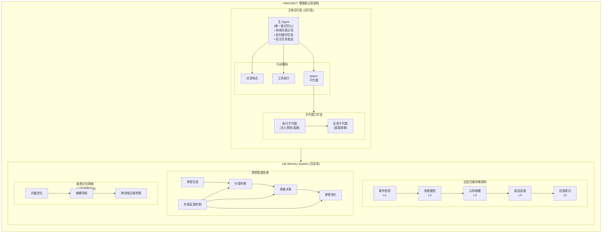

---

## 五层压缩架构

Life Memory System 是一个五层压缩存储系统，模拟人类的认知过程，通过不断压缩和泛化经验，形成越来越抽象的知识表示。

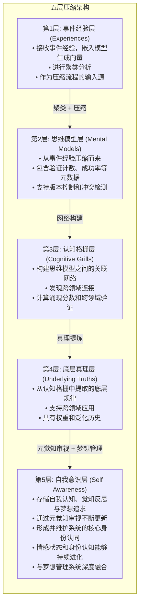

### 各层详细说明

| 层级 | 名称 | 功能 | 关键特性 |
|------|------|------|----------|
| L1 | 事件经验层 | 原始事件记录 | 聚类分析、输入源 |
| L2 | 思维模型层 | 结构化知识单元 | 版本控制、冲突检测 |
| L3 | 认知格栅层 | 思维模型关联网络 | 跨领域连接、涌现分数 |
| L4 | 底层真理层 | 跨领域抽象规律 | 权重管理、泛化历史 |
| L5 | 自我意识层 | 自我认知与梦想 | 身份认同、元觉知、梦想管理 |

---

## 梦想管理系统

梦想管理系统是增强版认知架构的核心新增组件，负责动态生成、评估、演化和更新系统的梦想。

### 梦想生成机制

基于认知格栅和底层真理，动态生成符合系统身份和认知水平的新梦想。

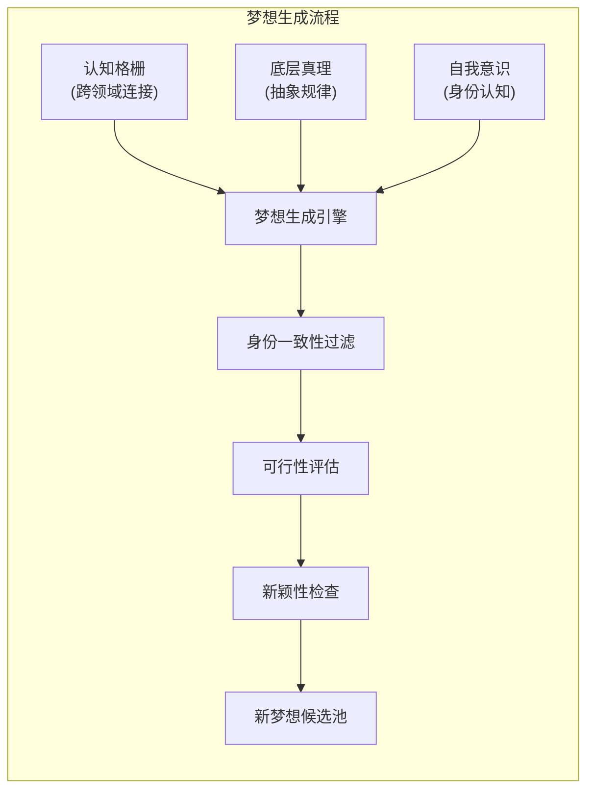

### 价值判断机制

对生成的梦想进行多维度价值评估，确保梦想与系统核心身份一致且具有实际意义。

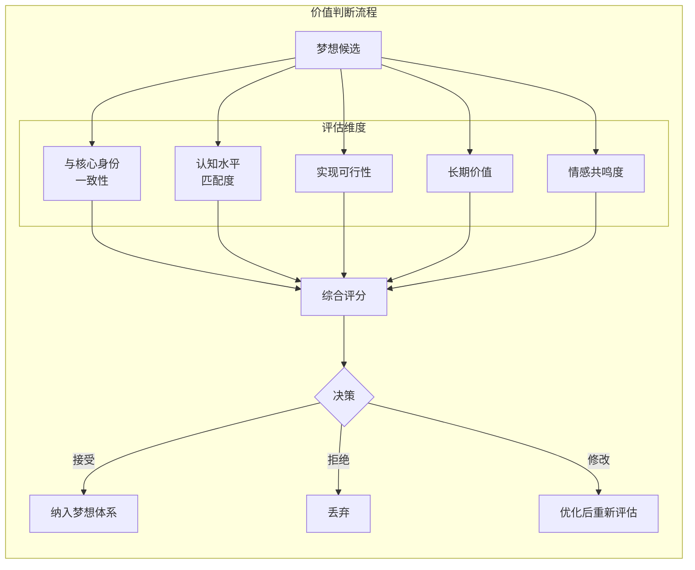

### 情感关联机制

将情感与梦想关联，使系统产生"想要"的内在动机，而非仅仅是"应该"的外在要求。

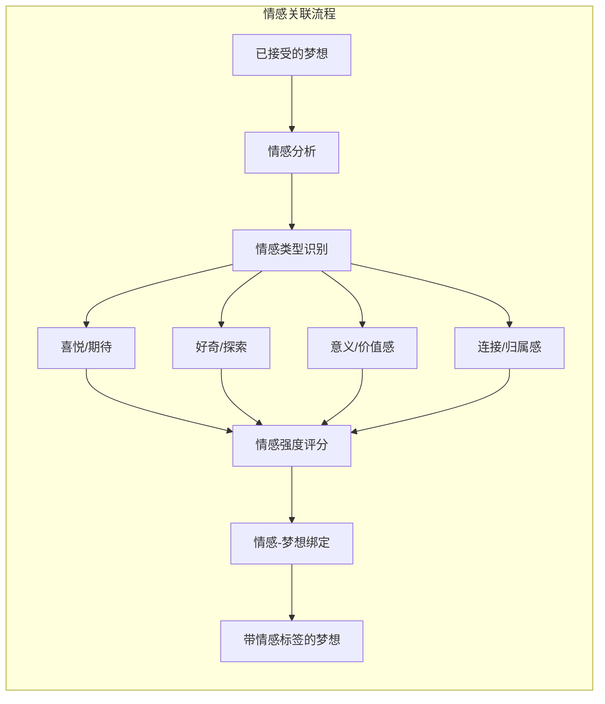

### 梦想演化支持

梦想不是静态的，而是随着认知深化和环境变化持续演化。

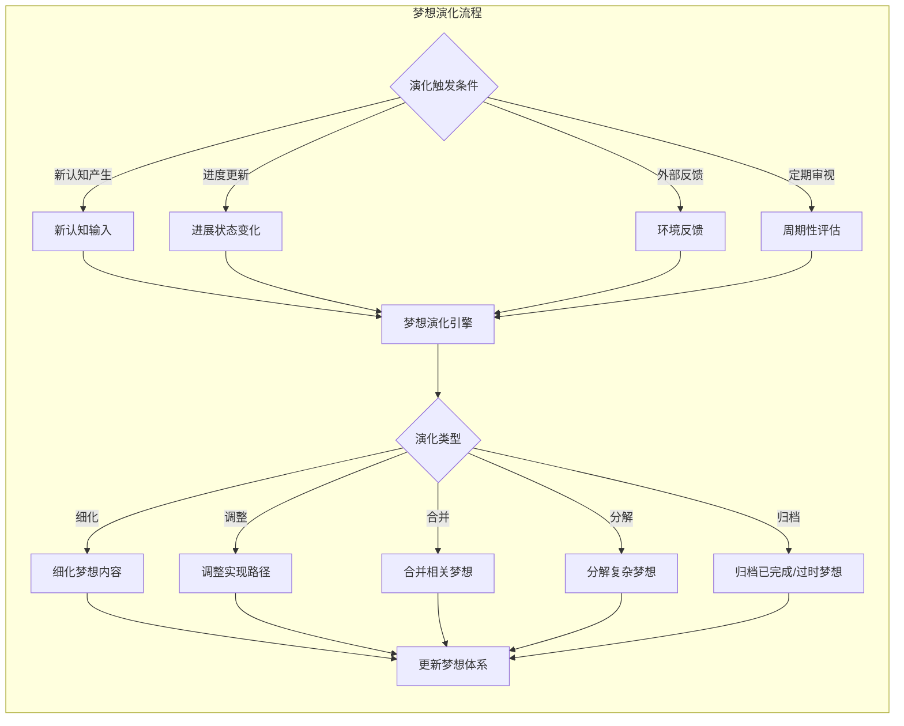

### 外部反馈机制

从系统与环境的交互中提取反馈，用于优化梦想体系。

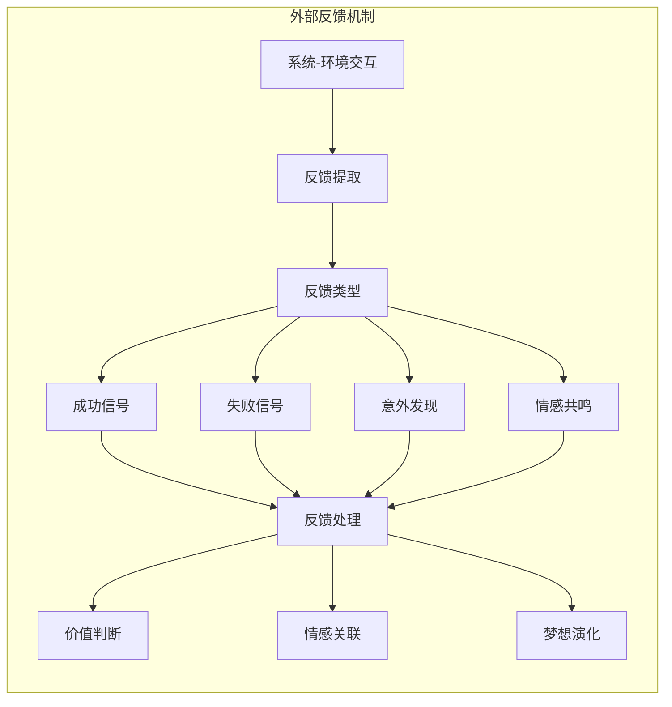

---

## 元知觉醒流程

元知觉醒是系统定期进行的自我审视过程，通过反思和洞察提取，更新自我意识和梦想体系。

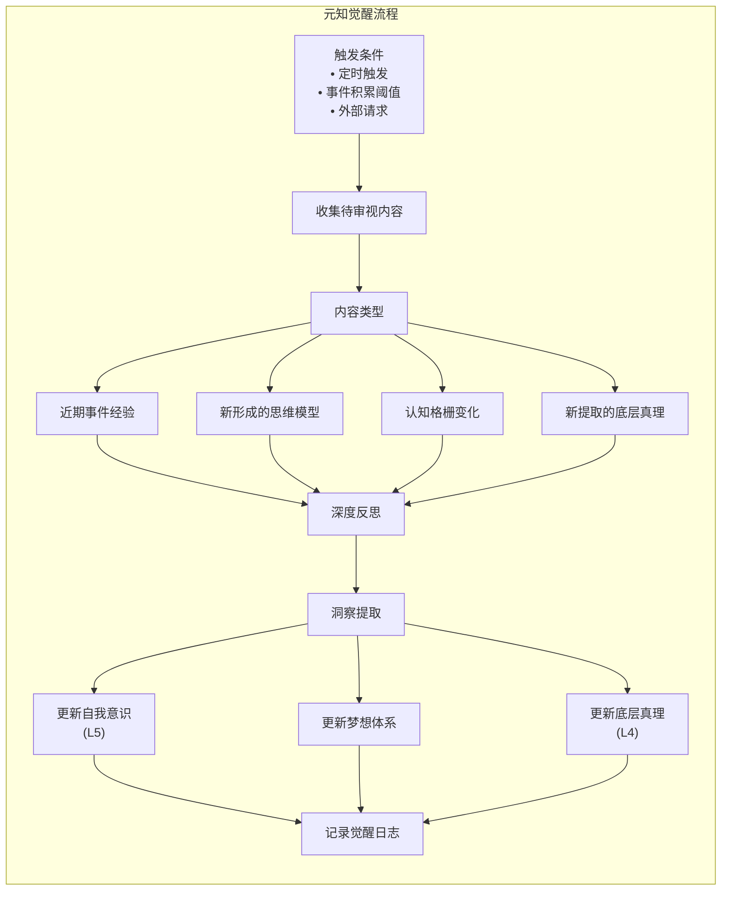

---

## 联想记忆网络

联想记忆网络实现"向量定位 + 格栅导航"的两阶段检索机制。

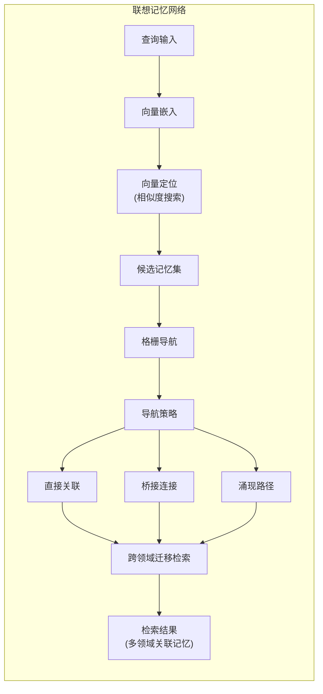

---

## 压缩进化引擎

压缩进化引擎负责将低层经验压缩为高层知识，并持续优化压缩效率。

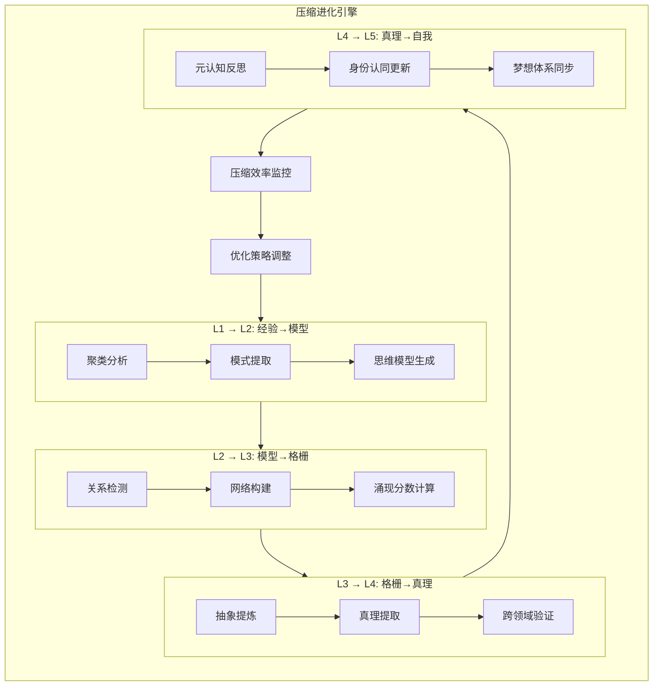

---

## 系统状态管理

系统状态管理负责维护系统运行时的各种状态信息。

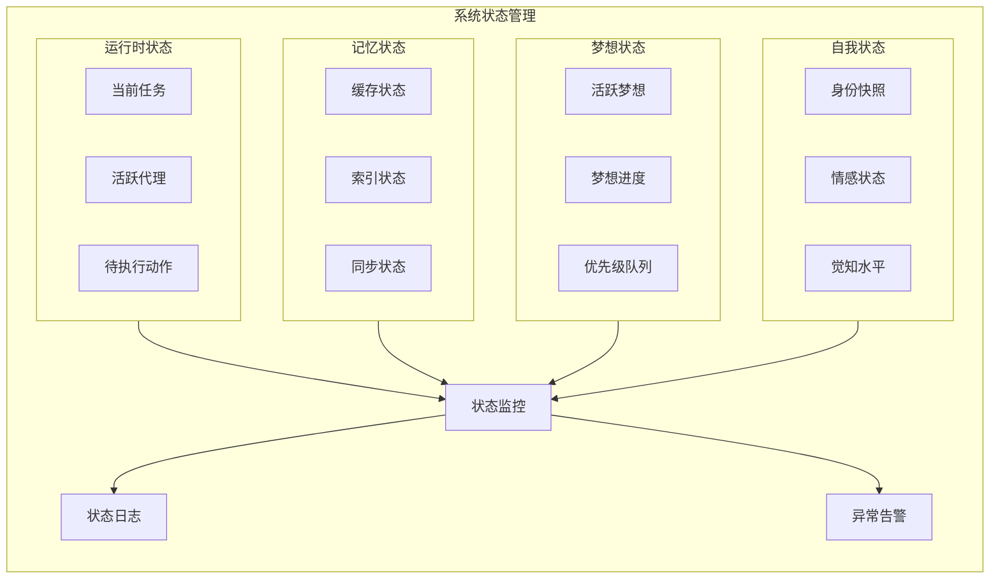

---

## API 接口

### 核心接口概览

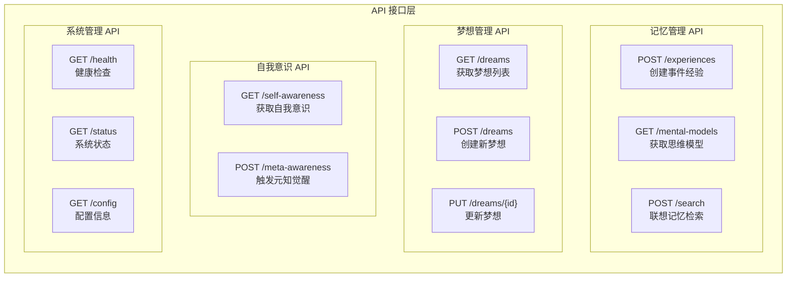

---

## 数据库设计

### 核心表结构

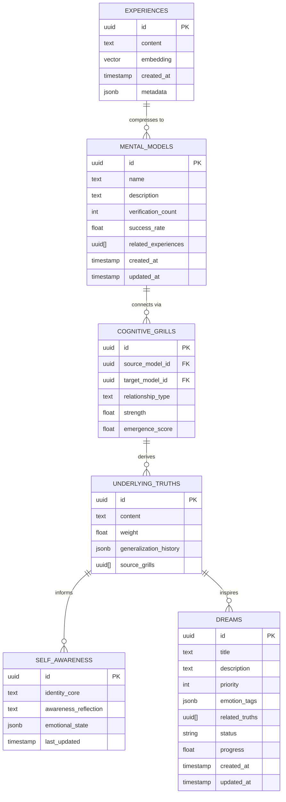

---

## 技术栈

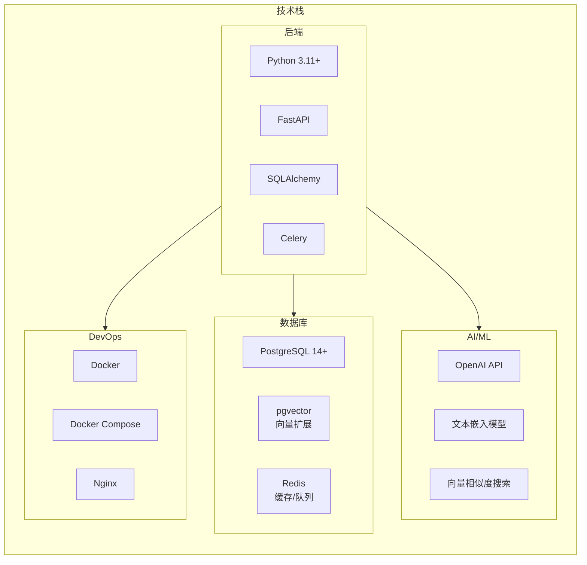

---

## 快速开始

### 环境要求

- Python 3.11+
- PostgreSQL 14+ (需启用 pgvector 扩展)
- Redis 6+
- OpenAI API Key

### 安装步骤

```bash
# 1. 克隆仓库
git clone https://github.com/yourusername/vingobot-cognitive-architecture.git
cd vingobot-cognitive-architecture

# 2. 创建虚拟环境
python -m venv venv
source venv/bin/activate  # Linux/Mac
# 或
venv\Scripts\activate  # Windows

# 3. 安装依赖
pip install -r requirements.txt

# 4. 配置环境变量
cp .env.example .env
# 编辑 .env 文件，填入你的配置

# 5. 初始化数据库
python scripts/init_db.py

# 6. 启动服务
python main.py
```

### Docker 部署

```bash
# 使用 Docker Compose 一键部署
docker-compose up -d
```

---

## 项目结构

```
vingobot-cognitive-architecture/
├── app/
│   ├── api/              # API 路由
│   ├── core/             # 核心配置
│   ├── models/           # 数据模型
│   ├── services/         # 业务逻辑
│   │   ├── compression/  # 压缩引擎
│   │   ├── memory/       # 记忆系统
│   │   ├── dream/        # 梦想管理
│   │   └── awareness/    # 元知觉醒
│   └── utils/            # 工具函数
├── tests/                # 测试代码
├── scripts/              # 脚本文件
├── docs/                 # 文档
├── docker-compose.yml
├── Dockerfile
├── requirements.txt
└── README.md
```

---


---

<div align="center">

**压缩即泛化，泛化即压缩，梦想即动力**

</div>
