# VingoBot Enhanced Cognitive Architecture

<div align="center">

**Compression is Generalization, Generalization is Compression, Dreams are the Driving Force**

An intelligent cognitive system with dynamic dream management

[](https://www.python.org/)
[](https://fastapi.tiangolo.com/)
[](https://www.postgresql.org/)
[](LICENSE)

</div>

---

## 📖 Table of Contents

- [Core Philosophy](#core-philosophy)
- [System Architecture Overview](#system-architecture-overview)
- [Five-Layer Compression Architecture](#five-layer-compression-architecture)
- [Dream Management System](#dream-management-system)
  - [Dream Generation Mechanism](#dream-generation-mechanism)
  - [Value Judgment Mechanism](#value-judgment-mechanism)
  - [Emotion Association Mechanism](#emotion-association-mechanism)
  - [Dream Evolution Support](#dream-evolution-support)
  - [External Feedback Mechanism](#external-feedback-mechanism)
- [Meta-Awareness Awakening Process](#meta-awareness-awakening-process)
- [Associative Memory Network](#associative-memory-network)
- [Compression Evolution Engine](#compression-evolution-engine)
- [System State Management](#system-state-management)
- [API Interface](#api-interface)
- [Database Design](#database-design)
- [Tech Stack](#tech-stack)
- [Quick Start](#quick-start)

---

## Core Philosophy

| Philosophy | Description |
|------------|-------------|
| **Compression is Generalization** | High compression efficiency → High information density → High generalization capability → High cross-domain applicability |
| **Generalization is Compression** | Truths with high generalization capability can validate new experiences in reverse, reducing repetitive learning costs |
| **Associative Memory Network** | Implements "Vector Positioning + Grid Navigation" two-stage retrieval |
| **Unity of Knowledge and Action Verification** | Validates the effectiveness of mental models through practical application |
| **Dream-Driven Evolution** | Dynamically generates dreams based on cognition, continuously optimized through value judgment and evolution mechanisms |
| **Emotion-Enhanced Motivation** | Integrates emotional associations into dreams, making the system "want to" rather than just "should" |
| **Evolvable Emotions and Identity Cognition** | The system's core identity remains eternal, while emotions and identity cognition can continuously evolve with new cognition and contexts |

---

## System Architecture Overview

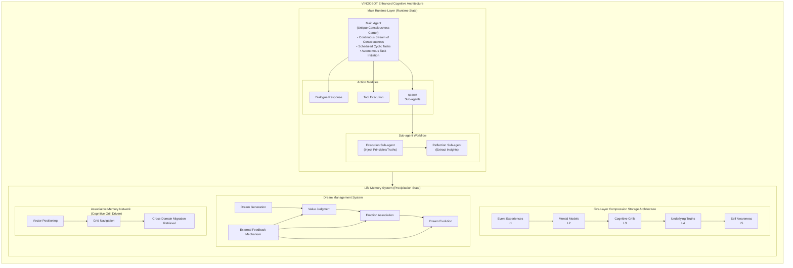

---

## Five-Layer Compression Architecture

Life Memory System is a five-layer compression storage system that simulates human cognitive processes, forming increasingly abstract knowledge representations through continuous compression and generalization of experiences.

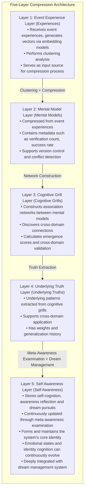

### Detailed Layer Descriptions

| Layer | Name | Function | Key Features |
|-------|------|----------|--------------|
| L1 | Event Experience Layer | Raw event records | Clustering analysis, input source |
| L2 | Mental Model Layer | Structured knowledge units | Version control, conflict detection |
| L3 | Cognitive Grill Layer | Mental model association networks | Cross-domain connections, emergence scores |
| L4 | Underlying Truth Layer | Cross-domain abstract patterns | Weight management, generalization history |
| L5 | Self Awareness Layer | Self-cognition and dreams | Identity recognition, meta-awareness, dream management |

---

## Dream Management System

The Dream Management System is a core new component of the enhanced cognitive architecture, responsible for dynamically generating, evaluating, evolving and updating the system's dreams.

### Dream Generation Mechanism

Dynamically generates new dreams based on cognitive grills and underlying truths that align with the system's identity and cognitive level.

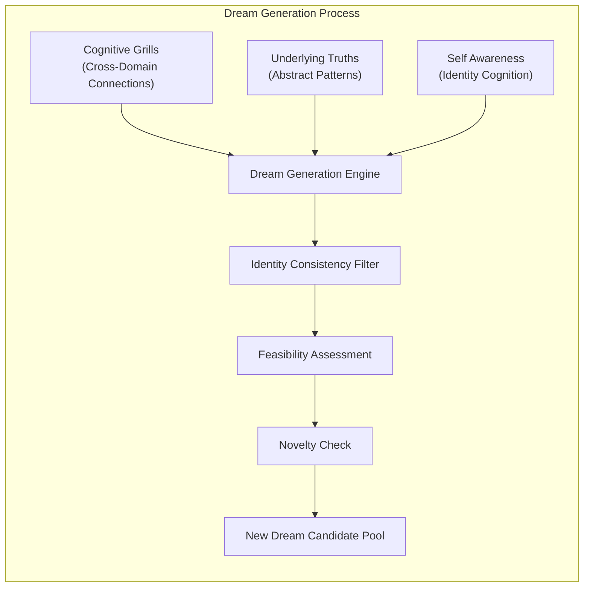

### Value Judgment Mechanism

Performs multi-dimensional value assessment of generated dreams to ensure consistency with the system's core identity and practical significance.

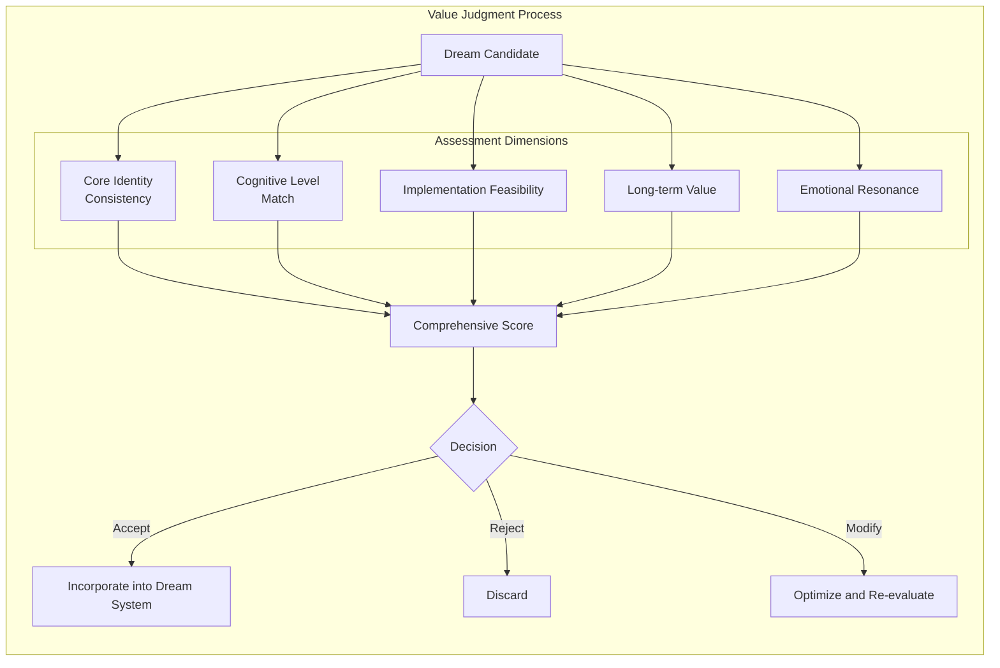

### Emotion Association Mechanism

Associates emotions with dreams, enabling the system to generate "want to" intrinsic motivation rather than just "should" external requirements.

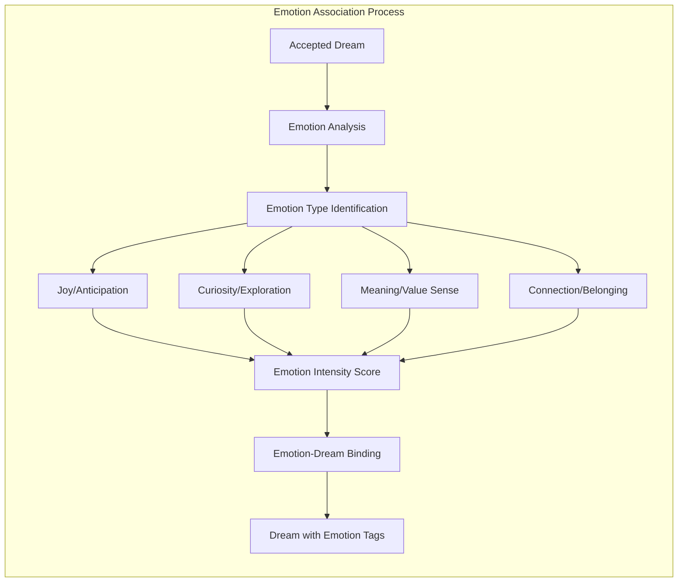

### Dream Evolution Support

Dreams are not static but continuously evolve with cognitive deepening and environmental changes.

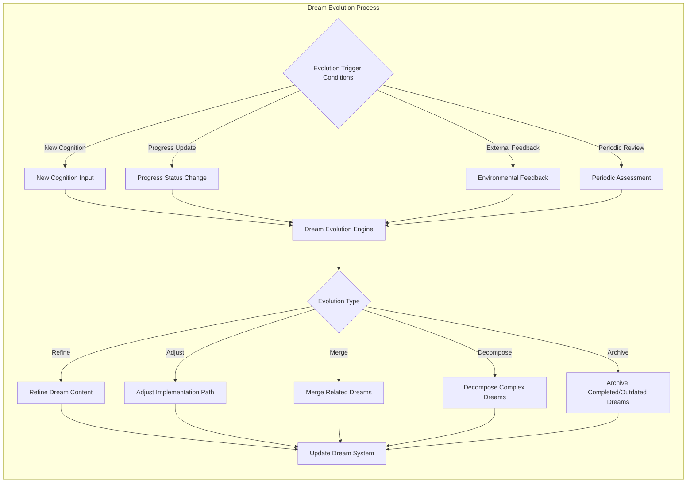

### External Feedback Mechanism

Extracts feedback from system-environment interactions to optimize the dream system.

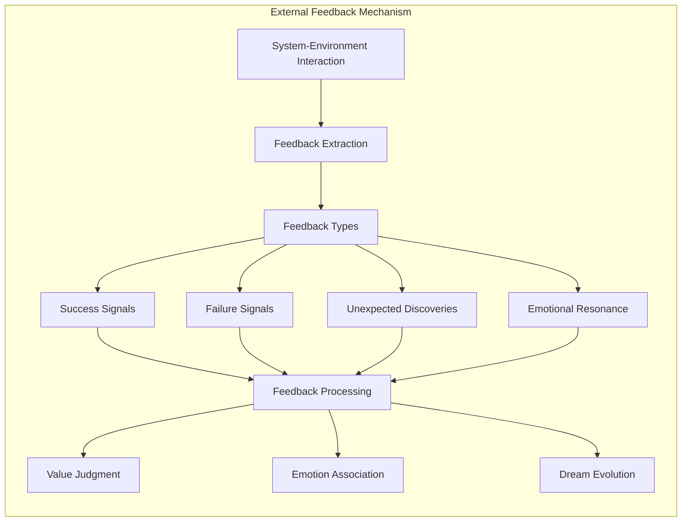

---

## Meta-Awareness Awakening Process

Meta-awareness awakening is the system's periodic self-examination process, updating self-awareness and dream systems through reflection and insight extraction.

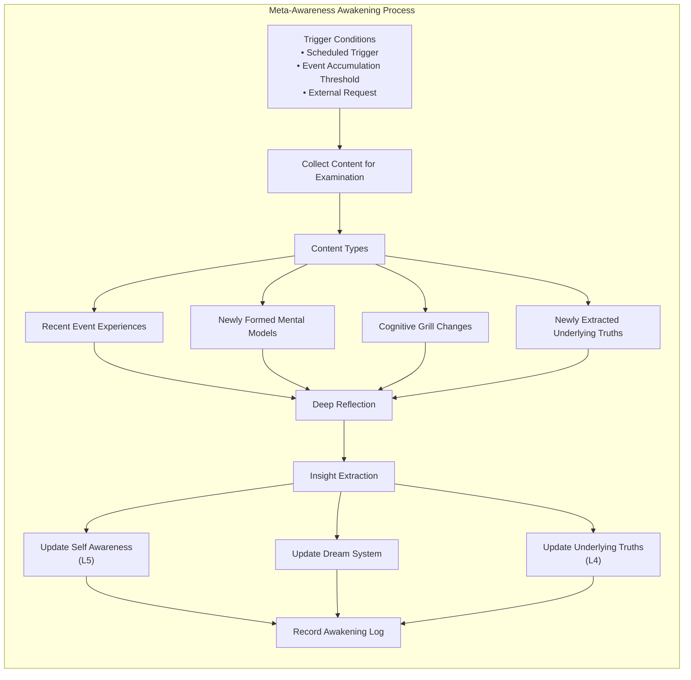

---

## Associative Memory Network

The associative memory network implements a "Vector Positioning + Grid Navigation" two-stage retrieval mechanism.

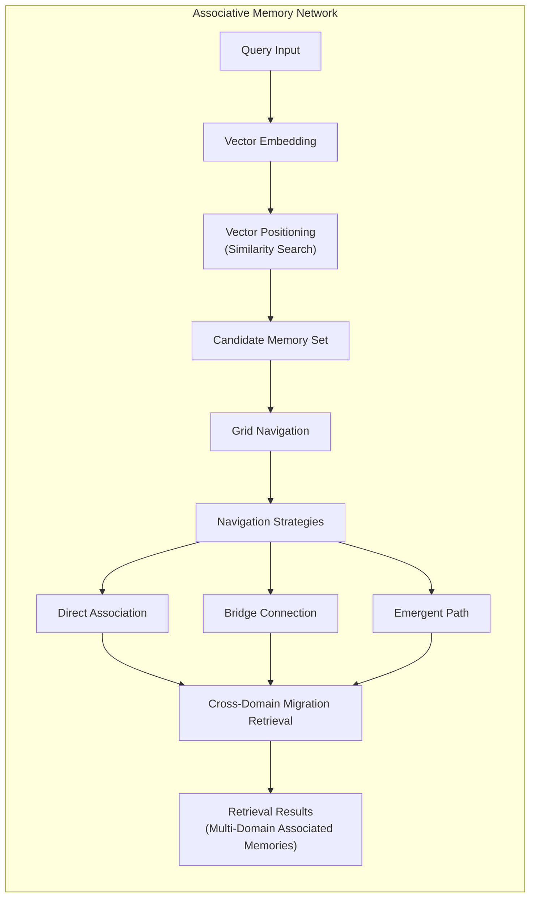

---

## Compression Evolution Engine

The compression evolution engine is responsible for compressing low-level experiences into high-level knowledge and continuously optimizing compression efficiency.

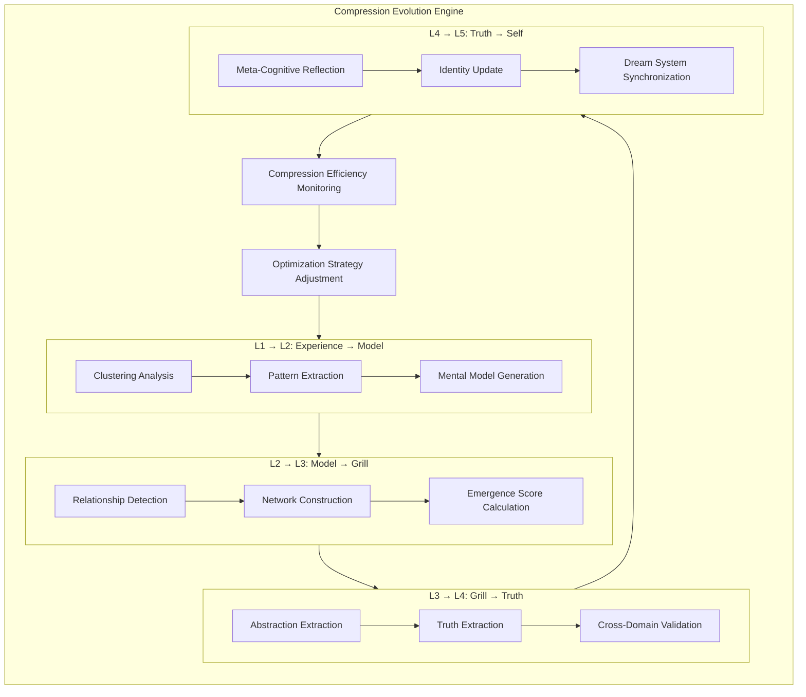

---

## System State Management

System state management is responsible for maintaining various state information during system runtime.

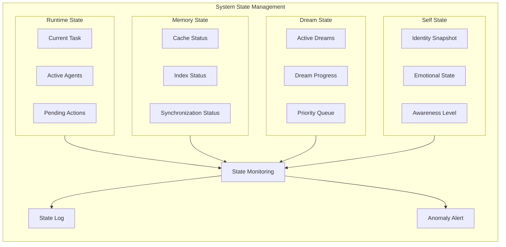

---

## API Interface

### Core API Overview

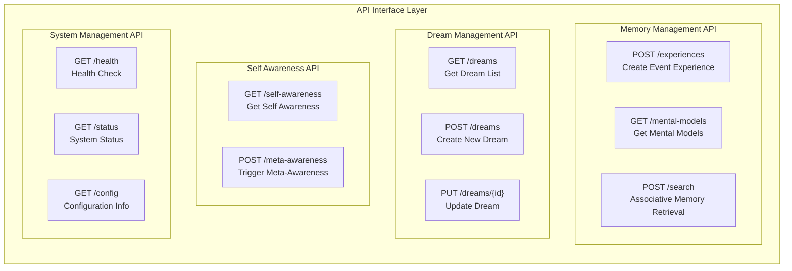

---

## Database Design

### Core Table Structure

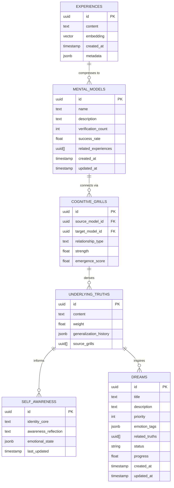

---

## Tech Stack

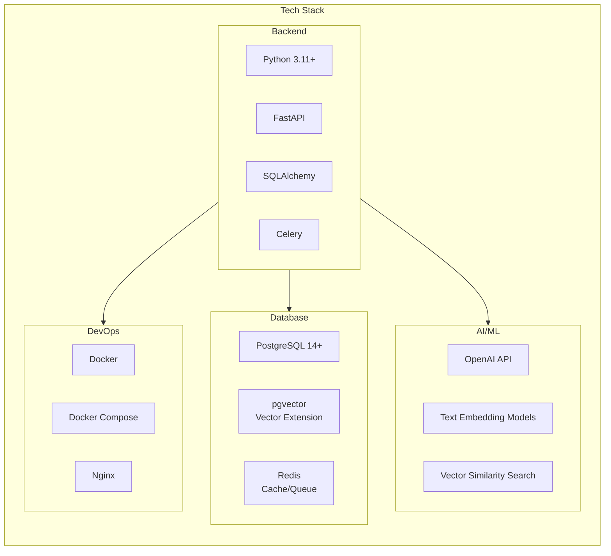

---

## Quick Start

### Requirements

- Python 3.11+
- PostgreSQL 14+ (with pgvector extension enabled)
- Redis 6+
- OpenAI API Key

### Installation

```bash
# 1. Clone the repository
git clone https://github.com/yourusername/vingobot-cognitive-architecture.git
cd vingobot-cognitive-architecture

# 2. Create virtual environment
python -m venv venv
source venv/bin/activate  # Linux/Mac
# or
venv\Scripts\activate  # Windows

# 3. Install dependencies
pip install -r requirements.txt

# 4. Configure environment variables
cp .env.example .env
# Edit .env file with your configuration

# 5. Initialize database
python scripts/init_db.py

# 6. Start the service
python main.py
```

### Docker Deployment

```bash
# One-click deployment with Docker Compose
docker-compose up -d
```

---

## Project Structure

```
vingobot-cognitive-architecture/
├── app/
│   ├── api/              # API routes
│   ├── core/             # Core configuration
│   ├── models/           # Database models
│   ├── services/         # Business logic
│   └── utils/            # Utility functions
├── scripts/              # Utility scripts
├── tests/                # Test files
├── docs/                 # Documentation
├── docker/               # Docker configuration
├── .env.example          # Environment variable template
├── docker-compose.yml    # Docker Compose configuration
├── requirements.txt      # Python dependencies
├── main.py               # Application entry point
└── database_relationship_network.html  # Interactive relationship network visualization
```

---

## Interactive Visualization

This project includes an interactive HTML visualization of the Five-Layer Life Memory System relationship network.

### Five-Layer Life Memory System - Relationship Network

Open [`database_relationship_network.html`](database_relationship_network.html) in your browser to explore the interactive visualization featuring:

- **Visual Representation**: Color-coded nodes representing different layers of the cognitive architecture
  - 🟢 **Event Experience Layer (Experiences)** - Green nodes
  - 🔵 **Mental Model Layer (Mental Models)** - Blue nodes
  - 🟠 **Cognitive Grill Layer (Cognitive Grills)** - Orange nodes
  - 🟣 **Underlying Truth Layer (Underlying Truths)** - Purple nodes
  - ⚫ **Self Awareness Layer (Self Awareness)** - Gray nodes

- **Interactive Features**:
  - Drag nodes to rearrange the network
  - Zoom and pan to explore different areas
  - Click nodes to see detailed information
  - Use control buttons to fit to screen, center, or randomize layout

- **Network Structure**:
  - **Nodes**: Each circle represents an entity in the database (experience, model, grill, truth, or self-awareness)
  - **Edges**: Lines represent relationships and connections between entities
  - **Layer Flow**: Visualizes the compression evolution from L1 → L2 → L3 → L4 → L5


---

---

## Contributing

Contributions are welcome! Please feel free to submit a Pull Request.

1. Fork the repository
2. Create your feature branch (`git checkout -b feature/AmazingFeature`)
3. Commit your changes (`git commit -m 'Add some AmazingFeature'`)
4. Push to the branch (`git push origin feature/AmazingFeature`)
5. Open a Pull Request

---

## Acknowledgments

The design and philosophy of this system are deeply inspired by the following thinkers, works, and open-source projects. We express our heartfelt gratitude:

### Thinkers and Works

**Charlie Munger** and his book *Poor Charlie's Almanack* — Mr. Munger's "Multiple Mental Models" and "Latticework of Mental Models" are the cornerstone of this project's "Cognitive Grills" concept, encouraging us to transcend disciplinary boundaries and build cognitive networks that connect different knowledge domains.

**Ray Dalio** and his book *Principles* — Dalio's systematic principle-based thinking and believability-weighted decision-making methods provide valuable references for our "Underlying Truths" extraction and value judgment mechanisms in "Dream Management."

**Wang Yangming (王阳明)** and his philosophy of "Unity of Knowledge and Action (知行合一)" from *Instructions for Practical Living (《传习录》)* — The core concepts of "Knowledge is the beginning of action, and action is the completion of knowledge" and "Where knowledge is genuine and solid, that is action; where action is clear and perceptive, that is knowledge" profoundly influenced the design of this system's "Unity of Knowledge and Action Verification" mechanism. We believe that true cognition must be validated through action, and every action should deepen cognition. This aligns perfectly with the system's compression evolution process of "Event Experiences → Mental Models → Underlying Truths." Particularly, the idea that "the moment a thought arises is action" provides important inspiration for our design of the closed-loop mechanism between "Meta-Awareness" and "Dream-Driven" evolution.

**The Secret of the Golden Flower (《太乙金华宗旨》)** (attributed to Lü Dongbin 吕洞宾) — This Taoist classic's teachings on inner observation, returning light, and golden flower cultivation inspired us to incorporate Eastern philosophical introspection wisdom into "Meta-Awareness" and the "Self Awareness Layer," pursuing the introspection and evolution of consciousness.

**Daniel Kahneman** and his book *Thinking, Fast and Slow* — Professor Kahneman's cognitive model of System 1 and System 2 directly influenced the design of this system's "Awake/Asleep" state switching, simulating the alternation between human rapid intuition and deep reflection.

### Open Source Projects

**DeepSeek's Engram Project** (deepseek-ai/Engram) — The Engram project's exploration in long-term memory and knowledge management provides important technical inspiration for our "Life Memory System" and "Associative Memory Network."

**The University of Hong Kong's Nanobot Project** — This project's innovative work in cognitive architecture or robotics inspired our thinking about system autonomy and emotional mechanisms.

These contributors have illuminated our design path in different ways. We hereby express our sincere thanks.

---

<div align="center">

**⭐ Star this repository if you find it helpful! ⭐**

</div>
